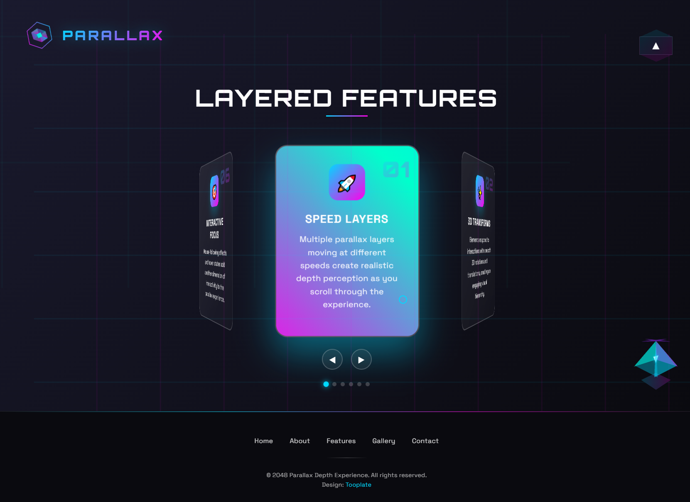

# Parallax Depth — WordPress Custom Theme

A custom WordPress theme built as a **learning project**, converting a one page static HTML parallax template into a multi-page WordPress site with dynamic content and custom meta boxes.

## 🚀 What This Project Covers

- Custom WordPress theme development
- Creating custom page templates
- Building meta boxes & saving custom fields
- Modular SCSS architecture
- Small JS interactions (parallax, animations, carousel)
- Clean theme structure with template parts and includes

## 🧩 Features

- Multi-page structure: Home, About, Features, Gallery, Contact
- Custom meta fields for each page (headings, text, images, cards)
- Responsive SCSS component-based styling
- Parallax layers, carousel, fade-in animations
- Follows WordPress coding standards (escaping, sanitization)

## 📁 Theme Structure (Simplified)

```
/includes        → meta boxes & backend logic
/scss            → modular SCSS
/js              → interaction scripts
page-*.php       → custom page templates
functions.php    → theme setup, assets, helpers
```

## 📸 Preview



```

## 📝 Notes

This project was created solely for learning **WordPress custom theme development**.
Original design belongs to [Tooplate - Parallax Depth](https://www.tooplate.com/view/2144-parallax-depth).

```
